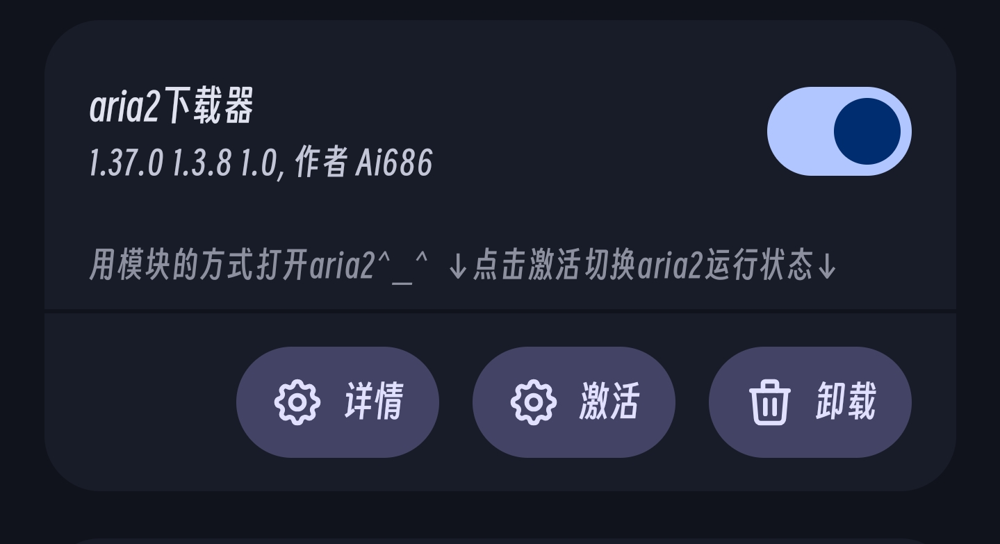

**🇨🇳中文** | [🇬🇧English](README_en.md)

# Aria2 for Android Module

使用 Magisk/KernelSU/APatch 等模块管理器在 Android 设备上运行 aria2 下载服务和 AriaNg Web UI。

## 📋 安装后必要配置

1. **RPC 地址设置**
   
   - 在 AriaNg Web UI 中，将 Aria2 RPC 地址设置为：`aria2-127-0-0-1.nip.io`
   - 如需使用自定义地址，请参考下文说明
2. **配置文件**
   
   - 模块已包含默认的 aria2 配置文件
   - 您可以根据需要替换 `/data/adb/modules/aria2-Android/` 目录下的配置文件
3. **安全证书**
   
   - 模块提供自签名根证书及 HTTPS 证书
   - 如需更高安全性，可自行替换证书文件
   - 证书位置：模块安装目录下的 `certs/` 文件夹
4. **RPC 密钥**
   
   - 默认密钥：`123456`
   - 可在配置文件中修改
5. **开机自启控制**
   
   - 如需禁用开机自启，请在模块目录创建空文件：`noaria2`
   - 或是在模块安装时用音量键选择

## ❓ 常见问题解答

### Q1: `aria2-127-0-0-1.nip.io` 是什么？

A: 这是由 [nip.io](https://nip.io) 提供的域名服务，可将包含 IP 的域名解析为对应 IP 地址。

### Q2: 为什么必须使用此域名而非本地地址？

A: 模块管理器通常要求使用 HTTPS 访问 Web UI，且无法直接使用 `127.0.0.1` 或 `localhost` 等本地地址。该解决方案可绕过此限制。

**提示**：如果确实需要使用本地地址（如 `localhost`），需要：1. 自行搭建服务器环境2. 将证书同时添加到用户证书和浏览器自带证书（部分浏览器需要 如：火狐）中。模块自带证书已对 `localhost` 进行签名，可直接使用该证书

### Q3: 如何配置自定义地址？

需要按以下步骤操作：

1. 将自定义域名指向本地地址
2. 为该域名生成并配置 SSL 证书
3. 替换模块中的证书文件

参考资源：[其一](https://blog.csdn.net/xiejianweifdd/article/details/132520188) | [其二](https://www.gworg.com/ssl/832.html)

### Q4: 无法连接到 aria2 怎么办？

请按顺序排查：

1. 检查证书是否过期
2. 查看模块目录下的日志文件
3. 验证 aria2 配置文件语法
4. 确认证书配置正确
5. Android 15+ 用户需检查系统证书兼容性
6. 确保未启用代理连接
7. Android 14+ 如安装其他证书模块，可能存在冲突

### Q5: 如何访问 Web UI？

- **推荐方式**：通过模块管理器的 Web UI 功能访问
- **备用方案**：使用支持为模块打开Web UI的插件访问

## 📁 项目组成

本模块整合了以下开源项目：

- **[aria2](https://github.com/aria2/aria2)**
- **[AriaNg](https://github.com/mayswind/AriaNg)** 

> 以上组件的版权归各自原作者所有，本模块仅为集成封装。
