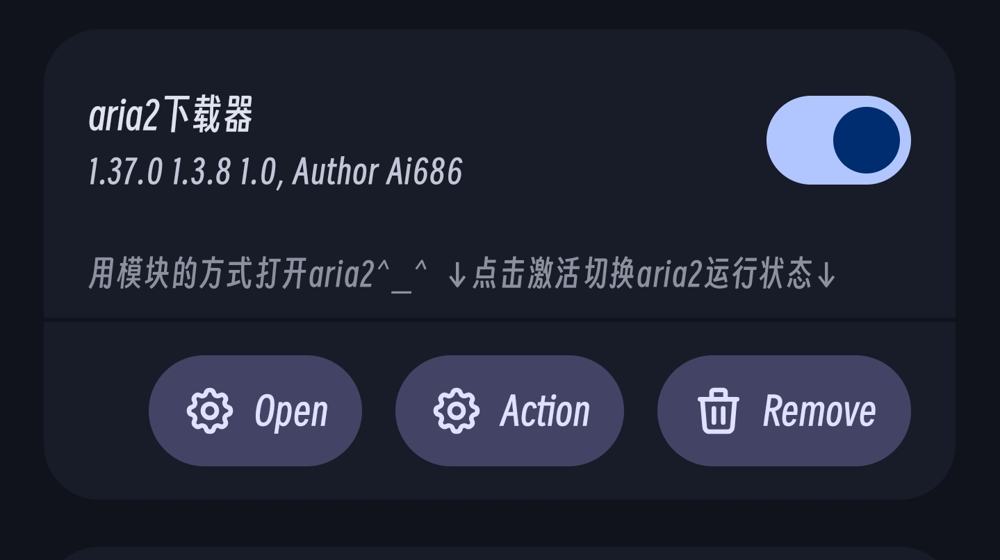

**🇬🇧English** | [🇨🇳中文](README.md) 

# aria2-for-module
Running aria2 and ariang with root module manager (Magisk/KernelSU/APatch)

# Required and optional configurations
1.**After installing the module, you need to set the Aria2 RPC address to aria2-127-0-0-1.nip.io in the Web UI**, if you don't want to use this address please check the following
 
2.The module generates a default aria2 configuration, which you can replace
 
"3. The module contains a self-signed root certificate and a self-signed certificate and key for aria2 to enable HTTPS, you can replace them if you feel insecure"
 
4.The default RPC key is 123456, you can change it in the configuration file.

# FAQs
1.What is 1.aria2-127-0-0-1.nip.io? --- This domain is provided by [nip.io](nip.io), you can go to that site to see what it is
 
2.Why is aria2-127-0-0-1.nip.io? --- Module Manager opens the Web UI using HTTPS by default, and Module Manager doesn't seem to be able to use addresses like 127.0.0.1 and localhost. I'm not looking for a solution at this stage, but if you want to use a local address, you can build your own server (Client browsers may also need to add certificates to user certificates and to the browser's own certificates) and use localhost (your certificate is signed for localhost).

3.How do I use a custom address? --- You need to sign the domain name after pointing it to a local address, see [this](https://blog.csdn.net/xiejianweifdd/article/details/132520188) and [ this](https://www.gworg.com/ssl/832.html)
 
4.Can't connect to aria2? ---
 
  -a. Please check if the certificate signature is expired
 
  -b. Please check the logs (located in the module directory)
 
  -c. Please check if the aria2 configuration file is correct
 
  -d. Please check if the certificate is correct
 
  -e. Please check if the system's certificate system is different from that of Android 15 and below (15 and above may not be an error either)
 
  -f. If the module manager does not connect, check that the RPC address is correct and that the proxy is turned off (not the settings in the Web UI).
 
  -g. Please check if there are other certificate modules and also Android version ≥14, there may be conflicts
 
5.Where is the Web UI? Where is the activation? --- It's in the module manager. If you can't find it, maybe your module manager is missing the relevant function? Normally it should be as shown in the picture. If the manager doesn't support it, you can use an app that specializes in opening the Web UI (Browsers on your phone may not be able to use that Web UI, even if it's packaged, that's why I've written them as modules)
    

# Project dependencies
The project contains [**aria2**](https://github.com/aria2/aria2), [**AriaNG(Web UI)**](https://github.com/mayswind/AriaNg)

The files for these two items in the module are copyrighted by the original authors

———————————
 
由中文版使用deepl翻译而来，可能意思有误

Translated from the Chinese version using deepl, the meaning may be wrong
